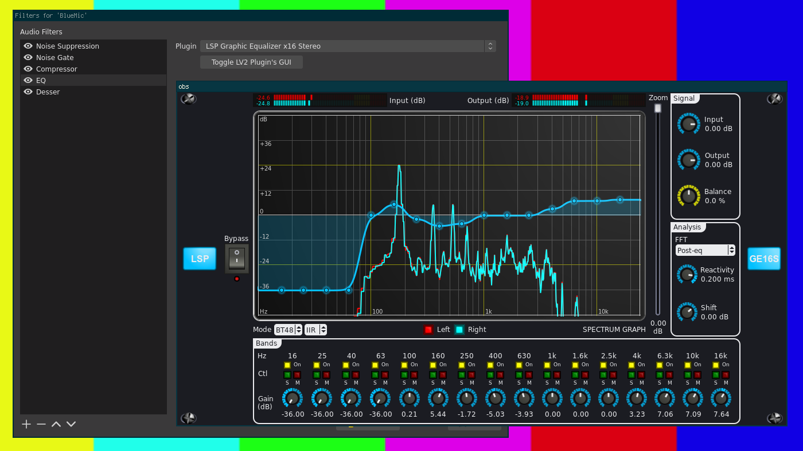

# OBS-LV2

LV2 plugin host for OBS.



## Warning

This plugin is in alpha state - some features may not work. It also may and
probably will crash your OBS. Backup your profile.

## Building && Installing

```
$ meson --prefix=/usr build/
$ ninja -C build
```

System-wide installation:

```
$ sudo ninja -C build install
```

Single user (works with OBS 25 on Arch):

```
$ meson -Dlocal_install=true build/
$ meson -C build install
```

or manually:

```
mkdir -p ~/.config/obs-studio/plugins/obs-lv2/bin/64bit/
cp -v build/obs-lv2.so ~/.config/obs-studio/plugins/obs-lv2/bin/64bit/
```

Paths may depend on your installation.

## Links

 * https://lv2plug.in/
 * https://lsp-plug.in/
 * http://calf-studio-gear.org/
